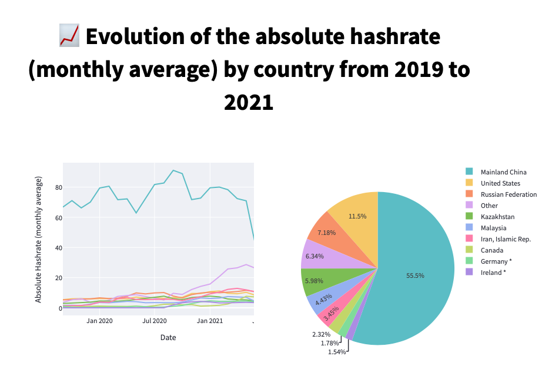

# Bitcoin Mining locations 2019 - 2021 📊
#### Data Visualization Project
##### Date: Marth 2022
#### Created by: Maria Soriano 👋🏼

👉🏼 Check it out here 👈🏼

## About
A dashboard displaying information about the changes on the Bitcoin Mining locations worlwide from 2019 - 2021. The information has been displayed interactively and in different ways so it's easy to understand more about the geographical changes in the mining locations during those years.

I try to answer the following questions:
1. How Bitcoin Mining locations have changed from 2019 - 2021?
2. What has happened with China?
3. What are the new emerging locations for mining Bitcoin?

## Technologies used
* Python
* Plotly library
* Streamlit
* Heroku (for deploying the App)

## Datasets
Data about hashrate (monthly average) by country can be found here: https://ccaf.io/cbeci/index
Data about China's hashrate (monthly average) by province can be found here: https://ccaf.io/cbeci/index

